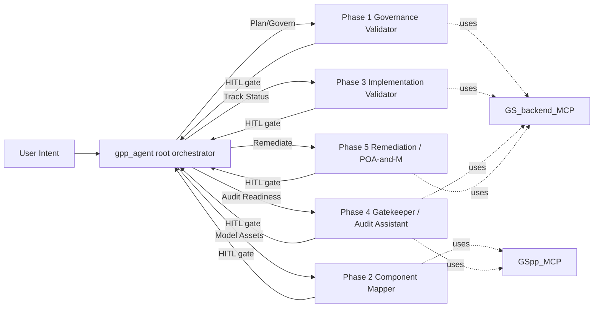

# Gpp-Agent Implementation Plan

This document tracks the work required to make the ADK `gpp-agent` strictly implement the
five-phase BSI Grundschutz++ gatekeeper workflow defined in [`planning.md`](planning.md:1).

The MCP plumbing, identity prompt, and a generic Maker-Checker `LoopAgent` already exist.
The phase-specific roles, prompts, tool grants, output schemas, and HITL gates do not.

---

## Gap Analysis (current state vs. `planning.md`)

| Area | Current state | Gap |
|---|---|---|
| MCP wiring | [`app/mcp_clients.py`](app/mcp_clients.py:22) exposes `get_anwender_toolset()` and `get_backend_toolset()` with ID-token auth. | None — reuse as-is. |
| Identity prompt | [`app/prompts/identity.md`](app/prompts/identity.md:1) is complete (BSI Lead Auditor, 20 Praktik). | None — load into every phase agent. |
| Phase prompts | Only generic [`ssp_generator/producer.md`](app/prompts/ssp_generator/producer.md:1) and [`ssp_generator/reviewer.md`](app/prompts/ssp_generator/reviewer.md:1) exist. | All 5 phase prompts missing. |
| Phase agents | Only generic [`producer.py`](app/agents/producer.py:6), [`reviewer.py`](app/agents/reviewer.py:7), and [`ssp_generator_workflow.py`](app/agents/ssp_generator_workflow.py:32) `LoopAgent`. | All 5 phase agents missing. |
| Orchestrator | [`app/agents/orchestrator.py`](app/agents/orchestrator.py:6) registers a single `ssp_generator_loop` and lists 4 mismatched capabilities. | Must register 5 phase agents and route by intent. |
| HITL gates | One vague sentence in the orchestrator instruction. | Need explicit state-key contract and per-phase confirmation prompt. |
| Output schemas | Only generic `ReviewCriteria` in [`app/schemas.py`](app/schemas.py:3). | Need per-phase Pydantic models for structured output_keys. |
| Tool filters | Generic agents grant unfiltered toolsets. | Each phase must receive only the tools its prompt declares. |
| Tests | [`tests/integration/test_agent.py`](tests/integration/test_agent.py:1) and [`tests/eval/evalsets/basic.evalset.json`](tests/eval/evalsets/basic.evalset.json:1) cover only generic flow. | Need cases for SoD, tailoring, planned-without-date, schema-invalid SSP, POA&M extraction. |
| Legacy code | Generic producer/reviewer/loop and `prompts/ssp_generator/` are still wired in. | Decision required: deprecate or repurpose inside Phase 2. |

---

## Target Architecture

State-key contract (for inter-phase handoff and HITL inspection):
`phase1_result`, `phase2_result`, `phase3_result`, `phase4_result`, `phase5_result`.

---

## Phase A: Schemas & State Contract

- [ ] Add per-phase Pydantic models in [`app/schemas.py`](app/schemas.py:1):
  - `GovernanceFindings` — `sod_violations: list[str]`, `high_impact_assets: list[str]`, `requires_overlay: bool`, `summary: str`.
  - `TailoringReport` — `blockers: list[dict]` (control_id, parameter, user_value, required), `gaps_for_poam: list[str]`, `summary: str`.
  - `ImplementationReport` — `unjustified_alternatives: list[str]`, `planned_without_date: list[str]`, `not_certifiable: bool`, `summary: str`.
  - `GatekeeperVerdict` — `phase: Literal["pre_check","audit_assist"]`, `cleared_for_audit: bool`, `schema_errors: list[str]`, `findings_suggestion: list[dict]`.
  - `RemediationPlan` — `created_poam_items: list[dict]`, `pending_user_input: list[str]`.
- [ ] Document the state-key contract in a docstring at the top of `app/agents/orchestrator.py` so each phase agent uses `output_key="phaseN_result"`.

## Phase B: Prompt Files (`app/prompts/`)

Each prompt must start with the YAML frontmatter pattern already used by [`prompts.py`](app/prompts.py:7) and embed the system instruction verbatim from `planning.md`, then add explicit tool-call rules.

- [ ] `phase1_governance.md` — Read SSP via `get_ssp_inventory` / `get_oscal_model_raw`; check `parties` for SoD (ISO ≠ IT-Mgmt ≠ Admin); scan `security-impact-level`; on `high` block basic protection and demand BSI 200-3 overlay import.
- [ ] `phase2_mapper.md` — Use `get_oscal_profile` and `controls_for_zielobjekt`; compare Component Definition vs. profile constraints; raise blocker on weakened tailoring (e.g. password length < 12); auto-flag uncovered controls for POA&M.
- [ ] `phase3_implementation.md` — Use `get_ssp_implementation`; reject `alternative` without justification; reject `planned` without `date-expected`; mark SSP as "not ready for initial certification" if any MUSS requirement is `planned` without authorized residual-risk acceptance.
- [ ] `phase4_gatekeeper.md` — Phase A: `verify_oscal_json` + profile reference check; refuse audit if any MUSS is `planned`/`partial` without risk acceptance. Phase B: per-control suggest `satisfied`/`not-satisfied` with observation text using `get_control`.
- [ ] `phase5_remediation.md` — Pull `not-satisfied` findings via `get_assessment_findings`; create POA&M items via `update_oscal_model` with hard UUID links to violated requirement and asset; draft milestones; ask user to validate responsibilities and deadlines.

## Phase C: Agent Modules (`app/agents/`)

Pattern for each: load `identity.md` + phase prompt, build a filtered `McpToolset` per `tool_filter`, set `output_schema` + `output_key="phaseN_result"`, write a precise `description` so the orchestrator can auto-route.

- [ ] `phase1_governance.py` → `get_governance_agent()`
  - backend `tool_filter=["get_ssp_inventory","get_ssp_implementation","get_oscal_model_raw","list_oscal_models"]`
  - `output_schema=GovernanceFindings`, `output_key="phase1_result"`
- [ ] `phase2_mapper.py` → `get_mapper_agent()`
  - anwender `tool_filter=["list_zielobjektkategorien","controls_for_zielobjekt","get_oscal_profile","get_control","list_groups","get_group"]`
  - backend (read-only) `tool_filter=["get_oscal_model_raw","get_ssp_inventory"]`
  - `output_schema=TailoringReport`, `output_key="phase2_result"`
- [ ] `phase3_implementation.py` → `get_implementation_agent()`
  - backend `tool_filter=["get_ssp_implementation","get_oscal_model_raw"]`
  - `output_schema=ImplementationReport`, `output_key="phase3_result"`
- [ ] `phase4_gatekeeper.py` → `get_gatekeeper_agent()`
  - anwender `tool_filter=["verify_oscal_json","get_control","get_oscal_profile"]`
  - backend `tool_filter=["create_oscal_model","update_oscal_model","get_oscal_model_raw","get_assessment_controls","get_assessment_subjects","get_resolved_profile_catalog"]`
  - `output_schema=GatekeeperVerdict`, `output_key="phase4_result"`
- [ ] `phase5_remediation.py` → `get_remediation_agent()`
  - backend `tool_filter=["get_assessment_findings","get_poam_items","update_oscal_model","create_oscal_model"]`
  - `output_schema=RemediationPlan`, `output_key="phase5_result"`

## Phase D: Orchestration & HITL Wiring

- [ ] Refactor [`app/agents/orchestrator.py`](app/agents/orchestrator.py:6) to import all five phase factories and register them as `sub_agents`.
- [ ] Rewrite the orchestrator instruction:
  - Map user intents to phases (use the BSI lifecycle vocabulary from `identity.md`).
  - Document the `phaseN_result` state-key contract.
  - Encode explicit HITL gates: after each sub-agent returns, summarize the structured result and require an explicit user confirmation before invoking the next phase. Do not auto-chain.
  - Forbid Phase 4 → Phase 5 transition if `phase4_result.cleared_for_audit` is False.
- [ ] Add per-phase `ORCHESTRATOR_MODEL` / `PHASEn_MODEL` env keys to [`.env.example`](.env.example:1) so model selection is overridable without code changes.

## Phase E: Legacy Code Disposition

- [ ] Decision needed (default recommendation: **deprecate**):
  - Remove [`app/agents/producer.py`](app/agents/producer.py:1), [`app/agents/reviewer.py`](app/agents/reviewer.py:1), [`app/agents/ssp_generator_workflow.py`](app/agents/ssp_generator_workflow.py:1), and [`app/prompts/ssp_generator/`](app/prompts/ssp_generator/producer.md:1).
  - Or, alternative: keep the Maker-Checker `LoopAgent` and embed it **inside** Phase 2 so component-definition drafting iterates against a reviewer pass before producing `TailoringReport`.
- [ ] Update any imports in [`app/agent.py`](app/agent.py:6) and [`app/agents/__init__.py`](app/agents/) that referenced the removed modules.

## Phase F: Tests & Evaluation

- [ ] Update [`tests/integration/test_agent.py`](tests/integration/test_agent.py:1) to assert `root_agent.sub_agents` contains the five phase agents by name and that each has the expected `output_schema`.
- [ ] Extend [`tests/eval/evalsets/basic.evalset.json`](tests/eval/evalsets/basic.evalset.json:1) with one evalcase per phase:
  - P1 — SSP where ISO and IT-Mgmt party UUIDs match → expect SoD violation flag.
  - P2 — User sets password length 8 against a profile demanding ≥12 → expect tailoring blocker.
  - P3 — Control with status `planned` but no `date-expected` → expect rejection and "not ready for certification".
  - P4 — Submit a syntactically broken OSCAL SSP → expect `verify_oscal_json` failure and audit refusal.
  - P5 — Assessment Result containing `not-satisfied` findings → expect auto-creation of POA&M entries linked to UUIDs.
- [ ] Run `agents-cli playground` against local MCPs (`scripts/run_local_gpp_agent_with_local_mcps.sh`) and walk the five scenarios manually.
- [ ] Run `uv run pytest tests/unit tests/integration` and `agents-cli eval run`; iterate until green.

## Phase G: Pre-Deployment Hand-off

- [ ] Update [`DESIGN_SPEC.md`](DESIGN_SPEC.md:1) "Tools Required" section if any new MCP tools are added during implementation.
- [ ] Confirm with user before running `agents-cli deploy` (per [`AGENTS.md`](AGENTS.md:27) Phase 5).
