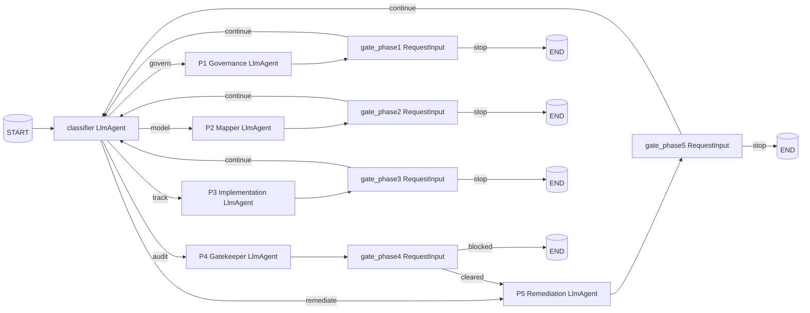

# Gpp-Agent Implementation Plan (ADK 2.0 Workflow API)

This plan implements the five-phase BSI Grundschutz++ gatekeeper workflow from
[`planning.md`](planning.md:1) on the **ADK 2.0 Workflow API** (pre-GA).
Decision rationale: structurally enforced HITL gates, conditional edges that make
"Phase 4 → Phase 5" impossible without `cleared_for_audit`, and built-in
checkpointing/resumability for long-running compliance flows.

> **Pre-GA notice.** ADK 2.0 APIs may change before GA. Pin a known-good `2.0.0aN`
> release once chosen and keep upgrade gated by tests.

---

## Gap Analysis vs. `planning.md`

| Area | Current state | Action |
|---|---|---|
| ADK version | [`pyproject.toml`](pyproject.toml:9) pinned to `google-adk>=1.15.0,<2.0.0` | Bump to `>=2.0.0a1`, run `uv sync --prerelease=allow`, verify `import google.adk.workflow`. |
| Orchestrator | [`app/agents/orchestrator.py`](app/agents/orchestrator.py:6) — single `Agent` with one sub-agent | Replace with a `Workflow` graph (classifier + 5 phase nodes + 5 HITL gates). |
| Phase prompts | None of the five exist | Create five prompt files (see Phase B). |
| Phase agents | None exist | Five `LlmAgent` nodes with strict `output_schema` and tool filters (see Phase C). |
| HITL | One vague sentence in orchestrator instruction | `RequestInput` event nodes between every phase, runtime-enforced. |
| Resumability | Not configured | Wrap the workflow with `ResumabilityConfig(is_resumable=True)`. |
| MCP wiring | [`app/mcp_clients.py`](app/mcp_clients.py:22) is fine | Reuse as-is — `McpToolset` works inside `LlmAgent` nodes in workflows. |
| Identity prompt | [`app/prompts/identity.md`](app/prompts/identity.md:1) is complete | Load into every phase agent. |
| Schemas | Only generic `ReviewCriteria` in [`app/schemas.py`](app/schemas.py:3) | Add per-phase Pydantic models + a workflow `state_schema`. |
| Legacy code | Generic [`producer.py`](app/agents/producer.py:1), [`reviewer.py`](app/agents/reviewer.py:1), [`ssp_generator_workflow.py`](app/agents/ssp_generator_workflow.py:32), [`prompts/ssp_generator/`](app/prompts/ssp_generator/producer.md:1) still wired | Deprecate (the Maker-Checker `LoopAgent` pattern does not map cleanly to a Workflow graph). |
| Tests | Generic flow only | Update integration tests to `InMemoryRunner`; extend evalsets with five phase scenarios. |
| Cloud Build / deploy | Targets Vertex AI Agent Runtime | Verify Agent Runtime accepts ADK 2.0 alpha during dev deploy. |

---

## Target Architecture



**State contract** (validated by `state_schema`):
`current_phase`, `phase1_result`, `phase2_result`, `phase3_result`,
`phase4_result`, `phase5_result`, `user_role`, `iv_id`.

---

## Phase A: Dependency & Environment Bump

- [x] Edit [`pyproject.toml`](pyproject.toml:1):
  - `dependencies`: replace `"google-adk>=1.15.0,<2.0.0"` with `"google-adk>=2.0.0a1"`. ✓
  - `[project.optional-dependencies] eval`: replace `"google-adk[eval]>=1.15.0,<2.0.0"` with `"google-adk[eval]>=2.0.0a1"`. ✓
  - Confirm `requires-python = ">=3.11,<3.14"` (already satisfies the 2.0 minimum). ✓
- [x] Run `uv sync --prerelease=allow`. → installed `google-adk==2.0.0b1`.
- [x] Sanity-check: imports `Workflow`, `RequestInput`, `ResumabilityConfig`, `Agent` all OK on 2.0.0b1.
- [ ] Verify Agent Runtime support during the first dev deploy. If `agents-cli deploy` fails, capture the error in this file and switch to ADK 1.x fallback plan (see Appendix). **(deferred — requires explicit user confirmation per [`AGENTS.md`](AGENTS.md:27))**
- [x] **Storage isolation**: App.name kept as `"app"` (must match the agent directory `app/`); to isolate from leftover ADK 1.x sessions, rename the directory or wipe dev sessions. See [`app/agent.py`](app/agent.py:33).

## Phase B: Schemas & State Contract (`app/schemas.py`)

- [x] Add Pydantic models (used as `output_schema` on each LlmAgent and as `state_schema` on the Workflow). See [`app/schemas.py`](app/schemas.py:1):
  - `GovernanceFindings` ✓
  - `TailoringReport` (+ `TailoringBlocker`) ✓
  - `ImplementationReport` ✓
  - `GatekeeperVerdict` (+ `FindingSuggestion`) ✓
  - `RemediationPlan` (+ `PoamItem`) ✓
  - `WorkflowState` (top-level state schema) ✓
  - `ClassifierOutput` ✓
- [x] Drop legacy `ReviewCriteria` / `Savepoint` — removed (no remaining references after the legacy cleanup in Phase G).

## Phase C: Phase Prompt Files (`app/prompts/`)

Each file uses the YAML frontmatter pattern already understood by [`prompts.py`](app/prompts.py:7). Content embeds the verbatim system instruction from `planning.md`, plus explicit tool-call rules and the expected `output_schema` reference.

- [x] [`classifier.md`](app/prompts/classifier.md:1) ✓
- [x] [`phase1_governance.md`](app/prompts/phase1_governance.md:1) ✓
- [x] [`phase2_mapper.md`](app/prompts/phase2_mapper.md:1) ✓
- [x] [`phase3_implementation.md`](app/prompts/phase3_implementation.md:1) ✓
- [x] [`phase4_gatekeeper.md`](app/prompts/phase4_gatekeeper.md:1) ✓
- [x] [`phase5_remediation.md`](app/prompts/phase5_remediation.md:1) ✓
- [x] HITL gate prompts (`gate_phase{1..5}.md`) — see [`app/prompts/gates/`](app/prompts/gates/gate_phase4.md:1).

## Phase D: Phase LlmAgent Nodes (`app/agents/`)

Pattern for each: load `identity.md` + phase prompt; build a `McpToolset` via [`app/mcp_clients.py`](app/mcp_clients.py:22) with the **exact** `tool_filter`; set `output_schema` and `output_key="phaseN_result"`. These will be placed directly in the workflow graph (auto-wrapped).

- [x] [`phase1_governance.py`](app/agents/phase1_governance.py:1) → `get_governance_agent()` ✓
- [x] [`phase2_mapper.py`](app/agents/phase2_mapper.py:1) → `get_mapper_agent()` ✓
- [x] [`phase3_implementation.py`](app/agents/phase3_implementation.py:1) → `get_implementation_agent()` ✓
- [x] [`phase4_gatekeeper.py`](app/agents/phase4_gatekeeper.py:1) → `get_gatekeeper_agent()` ✓
- [x] [`phase5_remediation.py`](app/agents/phase5_remediation.py:1) → `get_remediation_agent()` ✓
- [x] [`classifier.py`](app/agents/classifier.py:1) → `get_classifier_agent()` ✓ (no tools, `output_key="classifier_route"`)

## Phase E: Workflow Graph (`app/agents/orchestrator.py`)

**Done — see [`app/agents/orchestrator.py`](app/agents/orchestrator.py:1).**
The Workflow has 19 nodes / 19 edges (pinned by
[`tests/integration/test_agent.py::test_workflow_has_expected_nodes`](tests/integration/test_agent.py:1)).
The conditional routing follows the docs syntax `(node, {route: target})`.

- [x] Replace the file with a `Workflow` builder — `def get_workflow() -> Workflow`.
- [x] Define **HITL gate function nodes** (one per phase). Pattern:
  ```python
  async def gate_phase4(ctx: Context, node_input):
      if not ctx.resume_inputs:
          verdict = ctx.state["phase4_result"]
          yield RequestInput(
              interrupt_id="gate_phase4",
              message=f"Gatekeeper verdict: cleared={verdict['cleared_for_audit']}. Approve?",
              response_schema={"type": "string", "enum": ["cleared", "blocked"]},
          )
          return
      decision = ctx.resume_inputs["gate_phase4"]
      yield Event(output=decision, route=decision)
  ```
- [x] Wire edges:
  ```python
  edges = [
      (START, classifier),
      (classifier, P1, "govern"),
      (classifier, P2, "model"),
      (classifier, P3, "track"),
      (classifier, P4, "audit"),
      (classifier, P5, "remediate"),
      (P1, gate_phase1), (gate_phase1, classifier, "continue"),
      (P2, gate_phase2), (gate_phase2, classifier, "continue"),
      (P3, gate_phase3), (gate_phase3, classifier, "continue"),
      (P4, gate_phase4),
      (gate_phase4, P5, "cleared"),       # only path into P5
      (P5, gate_phase5), (gate_phase5, classifier, "continue"),
  ]
  ```
- [x] Set `Workflow(name="gpp_agent", state_schema=WorkflowState, edges=edges)`.
- [x] Forbid any other edge into P5 — pinned by
  [`test_phase4_gate_is_only_path_to_phase5_from_phase4`](tests/integration/test_agent.py:1).
  Only ingress edges into `phase5_remediation` are
  `classify_router --[remediate]→` and `gate_phase4_decision --[cleared]→`.

## Phase F: App Bootstrap (`app/agent.py`)

- [x] Replace `get_orchestrator()` import with `get_workflow()` ✓
- [x] Wrap with `ResumabilityConfig` ✓:
  ```python
  from google.adk.apps import App, ResumabilityConfig
  app = App(
      name="gpp_agent",
      root_agent=get_workflow(),
      resumability_config=ResumabilityConfig(is_resumable=True),
  )
  ```
- [x] Keep the existing `GOOGLE_CLOUD_*` env bootstrap as-is ✓
- [x] Decision: kept `App.name="app"` to satisfy the `adk web` / `agents-cli` runner-derived `app_name` rule. Storage isolation is achieved by renaming the agent directory or wiping dev sessions, not via `App.name`.

## Phase G: Legacy Code Removal

- [x] Deleted `app/agents/producer.py`.
- [x] Deleted `app/agents/reviewer.py`.
- [x] Deleted `app/agents/ssp_generator_workflow.py`.
- [x] Deleted `app/prompts/ssp_generator/` (both `producer.md` and `reviewer.md`).
- [x] No `app/agents/__init__.py` was present; [`app/agent.py`](app/agent.py:6) imports updated.
- [x] Removed `ReviewCriteria` and `Savepoint` from [`app/schemas.py`](app/schemas.py:1) (replaced by per-phase models).

## Phase H: Tests & Evaluation

- [x] Rewrote [`tests/integration/test_agent.py`](tests/integration/test_agent.py:1):
  - Asserts workflow node count (= 19) and the presence of P1–P5, classifier, classifier_router, and all 5 gates (incl. split P4 request/decision/blocked).
  - Asserts that `(P4 → P5)` requires `route="cleared"` and that there is **no** direct edge `phase4_gatekeeper → phase5_remediation`.
  - Adds runtime tests for `gate_phase4_decision` (forces `blocked` when verdict not cleared, honours user `cleared`, default-blocks unknown input).
  - Adds an HITL-emit smoke test that verifies `gate_phase1_request` actually yields a `RequestInput` event.
  - Adds an opt-in live LLM smoke test (`GPP_AGENT_LIVE_TESTS=1`) that uses `InMemoryRunner` against the real Workflow.
- [x] Extended [`tests/eval/evalsets/basic.evalset.json`](tests/eval/evalsets/basic.evalset.json:1) — one evalcase per phase (P1 SoD, P2 pwd-len blocker, P3 planned-without-date, P4 schema break, P5 POA&M creation).
- [x] HITL-resume coverage: `test_gate_phase1_request_yields_request_input` exercises the emit half; the live LLM test (opt-in) exercises end-to-end resume.
- [ ] Run `agents-cli playground` against local MCPs via [`scripts/run_local_gpp_agent_with_local_mcps.sh`](../scripts/run_local_gpp_agent_with_local_mcps.sh:1) and walk all five scenarios manually. **(deferred — manual / interactive)**
- [x] `uv run pytest tests/unit tests/integration/test_agent.py` → **11 passed, 1 skipped** (live test gated on `GPP_AGENT_LIVE_TESTS`).

## Phase I: Hand-off & Deployment

- [x] Updated [`DESIGN_SPEC.md`](DESIGN_SPEC.md:1):
  - "Agent Framework: ADK 2.0 Workflow API (pre-GA / Beta)" ✓
  - Added "Resumability" subsection ✓
  - Documented graph-enforced HITL via `RequestInput` ✓
- [ ] Verify [`agents-cli deploy`](AGENTS.md:27) succeeds against dev Agent Runtime. Capture any 2.0-alpha incompatibilities here. **(deferred — requires explicit user confirmation per `AGENTS.md` Phase 5)**
- [ ] **User confirmation required** before any prod deploy ([`AGENTS.md`](AGENTS.md:27) Phase 5).

---

## Appendix: ADK 1.x Fallback Plan

Keep this only if Agent Runtime rejects ADK 2.0 alpha during the first dev deploy:

1. Revert [`pyproject.toml`](pyproject.toml:9) to `google-adk>=1.15.0,<2.0.0`.
2. Replace `Workflow` with a router `Agent(sub_agents=[P1..P5])`.
3. Replace `RequestInput` HITL with `LongRunningFunctionTool` per phase (1.x mechanism for runtime-paused HITL — stronger than instruction-only gates).
4. Replace conditional edges with a `BaseAgent` `EscalationChecker` per phase that inspects `phaseN_result` and yields `EventActions(escalate=True)` when blocking conditions are detected.

## Bug Fixes

- [x] **Automatic Function Calling Error**: Fixed a `ValueError` during JSON Schema generation for the `route_to_phase` tool by changing the context parameter from `InvocationContext` to `ToolContext` (which is properly skipped by ADK's `FunctionTool` schema builder).
- [x] **Endless Tool Loop / Missing Jump**: Fixed an issue where the `classifier` agent would repeatedly call the `route_to_phase` tool instead of yielding to the graph. The agent's prompt was conflicting (told to call `finish_task` instead of `route_to_phase`), causing cognitive dissonance. Fixed the prompt, and switched state mutation to `tool_context.session.state` so the global session state is updated properly, allowing the `classify_router` to pick it up and transition to the target phase.

## Open Bugs

- [x] **Classifier Jump-Back Bug**: The `classifier` agent calls `route_to_phase`, but the workflow jumps back to the `chat` loop instead of routing to the target phase. Root cause: the tool wrote directly to `tool_context.session.state`, bypassing ADK's tracked tool state delta; after that fix, ADK still fed the FunctionResponse back to the classifier for summarization, causing repeated tool calls before the workflow reached `classify_router`. Fixed by writing through `tool_context.state` and setting `tool_context.actions.skip_summarization = True`, which lets the workflow advance to the router after the tool response.
