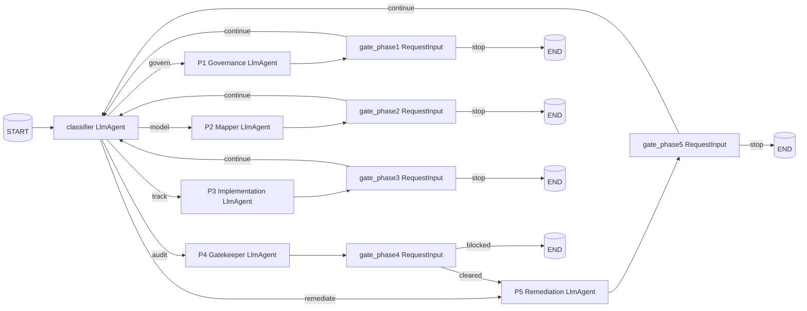

# Gpp-Agent Implementation Plan (ADK 2.0 Workflow API)

This plan implements the five-phase BSI Grundschutz++ gatekeeper workflow from
[`planning.md`](planning.md:1) on the **ADK 2.0 Workflow API** (pre-GA).
Decision rationale: structurally enforced HITL gates, conditional edges that make
"Phase 4 → Phase 5" impossible without `cleared_for_audit`, and built-in
checkpointing/resumability for long-running compliance flows.

> **Pre-GA notice.** ADK 2.0 APIs may change before GA. Pin a known-good `2.0.0aN`
> release once chosen and keep upgrade gated by tests.

---

## Gap Analysis vs. `planning.md`

| Area | Current state | Action |
|---|---|---|
| ADK version | [`pyproject.toml`](pyproject.toml:9) pinned to `google-adk>=1.15.0,<2.0.0` | Bump to `>=2.0.0a1`, run `uv sync --prerelease=allow`, verify `import google.adk.workflow`. |
| Orchestrator | [`app/agents/orchestrator.py`](app/agents/orchestrator.py:6) — single `Agent` with one sub-agent | Replace with a `Workflow` graph (classifier + 5 phase nodes + 5 HITL gates). |
| Phase prompts | None of the five exist | Create five prompt files (see Phase B). |
| Phase agents | None exist | Five `LlmAgent` nodes with strict `output_schema` and tool filters (see Phase C). |
| HITL | One vague sentence in orchestrator instruction | `RequestInput` event nodes between every phase, runtime-enforced. |
| Resumability | Not configured | Wrap the workflow with `ResumabilityConfig(is_resumable=True)`. |
| MCP wiring | [`app/mcp_clients.py`](app/mcp_clients.py:22) is fine | Reuse as-is — `McpToolset` works inside `LlmAgent` nodes in workflows. |
| Identity prompt | [`app/prompts/identity.md`](app/prompts/identity.md:1) is complete | Load into every phase agent. |
| Schemas | Only generic `ReviewCriteria` in [`app/schemas.py`](app/schemas.py:3) | Add per-phase Pydantic models + a workflow `state_schema`. |
| Legacy code | Generic [`producer.py`](app/agents/producer.py:1), [`reviewer.py`](app/agents/reviewer.py:1), [`ssp_generator_workflow.py`](app/agents/ssp_generator_workflow.py:32), [`prompts/ssp_generator/`](app/prompts/ssp_generator/producer.md:1) still wired | Deprecate (the Maker-Checker `LoopAgent` pattern does not map cleanly to a Workflow graph). |
| Tests | Generic flow only | Update integration tests to `InMemoryRunner`; extend evalsets with five phase scenarios. |
| Cloud Build / deploy | Targets Vertex AI Agent Runtime | Verify Agent Runtime accepts ADK 2.0 alpha during dev deploy. |

---

## Target Architecture



**State contract** (validated by `state_schema`):
`current_phase`, `phase1_result`, `phase2_result`, `phase3_result`,
`phase4_result`, `phase5_result`, `user_role`, `iv_id`.

---

## Phase A: Dependency & Environment Bump

- [ ] Edit [`pyproject.toml`](pyproject.toml:1):
  - `dependencies`: replace `"google-adk>=1.15.0,<2.0.0"` with `"google-adk>=2.0.0a1"`.
  - `[project.optional-dependencies] eval`: replace `"google-adk[eval]>=1.15.0,<2.0.0"` with `"google-adk[eval]>=2.0.0a1"`.
  - Confirm `requires-python = ">=3.11,<3.14"` (already satisfies the 2.0 minimum).
- [ ] Run `uv sync --prerelease=allow`.
- [ ] Sanity-check: `uv run python -c "import google.adk.workflow; from google.adk.events.request_input import RequestInput; print('OK')"`.
- [ ] Verify Agent Runtime support during the first dev deploy. If `agents-cli deploy` fails, capture the error in this file and switch to ADK 1.x fallback plan (see Appendix).
- [ ] **Storage isolation**: ensure no ADK 1.x persistent sessions exist for this app name in the dev GCP project. If they do, rename the agent (`name="gpp_agent_v2"`) or wipe sessions.

## Phase B: Schemas & State Contract (`app/schemas.py`)

- [ ] Add Pydantic models (used as `output_schema` on each LlmAgent and as `state_schema` on the Workflow):
  - `GovernanceFindings` — `sod_violations: list[str]`, `high_impact_assets: list[str]`, `requires_overlay: bool`, `summary: str`.
  - `TailoringReport` — `blockers: list[TailoringBlocker]`, `gaps_for_poam: list[str]`, `summary: str`.
  - `ImplementationReport` — `unjustified_alternatives: list[str]`, `planned_without_date: list[str]`, `not_certifiable: bool`, `summary: str`.
  - `GatekeeperVerdict` — `phase: Literal["pre_check","audit_assist"]`, `cleared_for_audit: bool`, `schema_errors: list[str]`, `findings_suggestion: list[FindingSuggestion]`.
  - `RemediationPlan` — `created_poam_items: list[PoamItem]`, `pending_user_input: list[str]`.
  - `WorkflowState` — top-level state schema with `current_phase`, all `phaseN_result` keys (Optional), `user_role`, `iv_id`.
  - `ClassifierOutput` — `route: Literal["govern","model","track","audit","remediate"]`, `rationale: str`.
- [ ] Drop or rename the now-unused `ReviewCriteria` and `Savepoint` if no longer referenced after legacy cleanup.

## Phase C: Phase Prompt Files (`app/prompts/`)

Each file uses the YAML frontmatter pattern already understood by [`prompts.py`](app/prompts.py:7). Content embeds the verbatim system instruction from `planning.md`, plus explicit tool-call rules and the expected `output_schema` reference.

- [ ] `classifier.md` — Read user message; pick exactly one of `govern | model | track | audit | remediate` based on intent vocabulary aligned with [`identity.md`](app/prompts/identity.md:1). Output: `ClassifierOutput`.
- [ ] `phase1_governance.md` — SoD on `parties` (ISO ≠ IT-Mgmt ≠ Admin); scan `security-impact-level`; on `high` block basic protection and demand BSI 200-3 overlay import. Output: `GovernanceFindings`.
- [ ] `phase2_mapper.md` — Use `get_oscal_profile` and `controls_for_zielobjekt`; compare Component Definition vs. profile constraints; raise blocker on weakened tailoring (e.g. password length < 12); auto-flag uncovered controls for POA&M. Output: `TailoringReport`.
- [ ] `phase3_implementation.md` — Reject `alternative` without justification; reject `planned` without `date-expected`; mark SSP "not ready for initial certification" if any MUSS requirement is `planned` without authorized residual-risk acceptance. Output: `ImplementationReport`.
- [ ] `phase4_gatekeeper.md` — Phase A: `verify_oscal_json` + profile reference check; refuse audit if any MUSS is `planned`/`partial` without risk acceptance. Phase B: per-control suggest `satisfied`/`not-satisfied` with observation text using `get_control`. Output: `GatekeeperVerdict`.
- [ ] `phase5_remediation.md` — Pull `not-satisfied` findings via `get_assessment_findings`; create POA&M items via `update_oscal_model` with hard UUID links to violated requirement and asset; draft milestones; ask user to validate responsibilities and deadlines. Output: `RemediationPlan`.
- [ ] HITL gate prompts (one per phase) — short user-facing summaries shown via `RequestInput.message`, e.g.:
  - `gate_phase4.md` — "Phase 4 verdict: cleared_for_audit={value}. Review schema_errors. Do you authorize moving to Phase 5 (Remediation)?".

## Phase D: Phase LlmAgent Nodes (`app/agents/`)

Pattern for each: load `identity.md` + phase prompt; build a `McpToolset` via [`app/mcp_clients.py`](app/mcp_clients.py:22) with the **exact** `tool_filter`; set `output_schema` and `output_key="phaseN_result"`. These will be placed directly in the workflow graph (auto-wrapped).

- [ ] `phase1_governance.py` → `get_governance_agent() -> LlmAgent`
  - backend `tool_filter=["get_ssp_inventory","get_ssp_implementation","get_oscal_model_raw","list_oscal_models"]`
  - `output_schema=GovernanceFindings`, `output_key="phase1_result"`.
- [ ] `phase2_mapper.py` → `get_mapper_agent() -> LlmAgent`
  - anwender `tool_filter=["list_zielobjektkategorien","controls_for_zielobjekt","get_oscal_profile","get_control","list_groups","get_group"]`
  - backend `tool_filter=["get_oscal_model_raw","get_ssp_inventory"]`
  - `output_schema=TailoringReport`, `output_key="phase2_result"`.
- [ ] `phase3_implementation.py` → `get_implementation_agent() -> LlmAgent`
  - backend `tool_filter=["get_ssp_implementation","get_oscal_model_raw"]`
  - `output_schema=ImplementationReport`, `output_key="phase3_result"`.
- [ ] `phase4_gatekeeper.py` → `get_gatekeeper_agent() -> LlmAgent`
  - anwender `tool_filter=["verify_oscal_json","get_control","get_oscal_profile"]`
  - backend `tool_filter=["create_oscal_model","update_oscal_model","get_oscal_model_raw","get_assessment_controls","get_assessment_subjects","get_resolved_profile_catalog"]`
  - `output_schema=GatekeeperVerdict`, `output_key="phase4_result"`.
- [ ] `phase5_remediation.py` → `get_remediation_agent() -> LlmAgent`
  - backend `tool_filter=["get_assessment_findings","get_poam_items","update_oscal_model","create_oscal_model"]`
  - `output_schema=RemediationPlan`, `output_key="phase5_result"`.
- [ ] `classifier.py` → `get_classifier_agent() -> LlmAgent` with `output_schema=ClassifierOutput`, `output_key="classifier_route"`. No tools.

## Phase E: Workflow Graph (`app/agents/orchestrator.py`)

- [ ] Replace the file with a `Workflow` builder, e.g. `def get_workflow() -> Workflow`.
- [ ] Define **HITL gate function nodes** (one per phase). Pattern:
  ```python
  async def gate_phase4(ctx: Context, node_input):
      if not ctx.resume_inputs:
          verdict = ctx.state["phase4_result"]
          yield RequestInput(
              interrupt_id="gate_phase4",
              message=f"Gatekeeper verdict: cleared={verdict['cleared_for_audit']}. Approve?",
              response_schema={"type": "string", "enum": ["cleared", "blocked"]},
          )
          return
      decision = ctx.resume_inputs["gate_phase4"]
      yield Event(output=decision, route=decision)
  ```
- [ ] Wire edges:
  ```python
  edges = [
      (START, classifier),
      (classifier, P1, "govern"),
      (classifier, P2, "model"),
      (classifier, P3, "track"),
      (classifier, P4, "audit"),
      (classifier, P5, "remediate"),
      (P1, gate_phase1), (gate_phase1, classifier, "continue"),
      (P2, gate_phase2), (gate_phase2, classifier, "continue"),
      (P3, gate_phase3), (gate_phase3, classifier, "continue"),
      (P4, gate_phase4),
      (gate_phase4, P5, "cleared"),       # only path into P5
      (P5, gate_phase5), (gate_phase5, classifier, "continue"),
  ]
  ```
- [ ] Set `Workflow(name="gpp_agent", state_schema=WorkflowState, edges=edges)`.
- [ ] Forbid any other edge into P5 — `P4` is the only gate. The graph itself enforces the planning.md rule.

## Phase F: App Bootstrap (`app/agent.py`)

- [ ] Replace `get_orchestrator()` import with `get_workflow()`.
- [ ] Wrap with `ResumabilityConfig`:
  ```python
  from google.adk.apps import App, ResumabilityConfig
  app = App(
      name="gpp_agent",
      root_agent=get_workflow(),
      resumability_config=ResumabilityConfig(is_resumable=True),
  )
  ```
- [ ] Keep the existing `GOOGLE_CLOUD_*` env bootstrap as-is.
- [ ] Decision: rename `name="gpp_agent"` → `name="gpp_agent_v2"` if any 1.x sessions exist for the same app name (storage isolation rule).

## Phase G: Legacy Code Removal

- [ ] Delete [`app/agents/producer.py`](app/agents/producer.py:1).
- [ ] Delete [`app/agents/reviewer.py`](app/agents/reviewer.py:1).
- [ ] Delete [`app/agents/ssp_generator_workflow.py`](app/agents/ssp_generator_workflow.py:1).
- [ ] Delete [`app/prompts/ssp_generator/`](app/prompts/ssp_generator/producer.md:1) (both `producer.md` and `reviewer.md`).
- [ ] Update [`app/agents/__init__.py`](app/agents/) (if present) and any imports in [`app/agent.py`](app/agent.py:6).
- [ ] Remove `ReviewCriteria` from [`app/schemas.py`](app/schemas.py:3) if unused after refactor.

## Phase H: Tests & Evaluation

- [ ] Rewrite [`tests/integration/test_agent.py`](tests/integration/test_agent.py:1) using `InMemoryRunner`:
  - Assert workflow node count and presence of P1–P5, classifier, and five gates.
  - Assert that `(P4 → P5)` requires the `"cleared"` route (graph validation).
- [ ] Extend [`tests/eval/evalsets/basic.evalset.json`](tests/eval/evalsets/basic.evalset.json:1) — one evalcase per phase:
  - P1 — SSP where ISO and IT-Mgmt party UUIDs match → expect `sod_violations` non-empty.
  - P2 — User sets password length 8 against profile demanding ≥12 → expect `blockers` non-empty.
  - P3 — Control with `planned` status but no `date-expected` → expect `planned_without_date` non-empty and `not_certifiable=true`.
  - P4 — Syntactically broken OSCAL SSP → expect `cleared_for_audit=false` and `schema_errors` non-empty.
  - P5 — AR with `not-satisfied` findings → expect `created_poam_items` non-empty.
- [ ] Add an HITL-resume integration test: run workflow → expect `RequestInput` event → submit user response → assert routing decision.
- [ ] Run `agents-cli playground` against local MCPs via [`scripts/run_local_gpp_agent_with_local_mcps.sh`](../scripts/run_local_gpp_agent_with_local_mcps.sh:1) and walk all five scenarios manually.
- [ ] Run `uv run pytest tests/unit tests/integration` and `agents-cli eval run` until green.

## Phase I: Hand-off & Deployment

- [ ] Update [`DESIGN_SPEC.md`](DESIGN_SPEC.md:1):
  - Architecture: switch "Agent Framework: ADK" to "ADK 2.0 Workflow API (pre-GA)".
  - Add a "Resumability" subsection.
  - Note that HITL is graph-enforced via `RequestInput`.
- [ ] Verify [`agents-cli deploy`](AGENTS.md:27) succeeds against dev Agent Runtime. Capture any 2.0-alpha incompatibilities here.
- [ ] **User confirmation required** before any prod deploy ([`AGENTS.md`](AGENTS.md:27) Phase 5).

---

## Appendix: ADK 1.x Fallback Plan

Keep this only if Agent Runtime rejects ADK 2.0 alpha during the first dev deploy:

1. Revert [`pyproject.toml`](pyproject.toml:9) to `google-adk>=1.15.0,<2.0.0`.
2. Replace `Workflow` with a router `Agent(sub_agents=[P1..P5])`.
3. Replace `RequestInput` HITL with `LongRunningFunctionTool` per phase (1.x mechanism for runtime-paused HITL — stronger than instruction-only gates).
4. Replace conditional edges with a `BaseAgent` `EscalationChecker` per phase that inspects `phaseN_result` and yields `EventActions(escalate=True)` when blocking conditions are detected.
